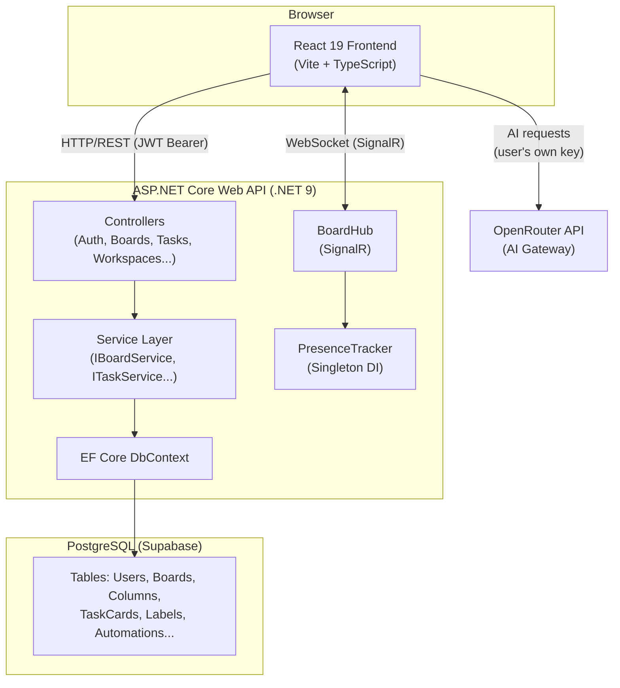
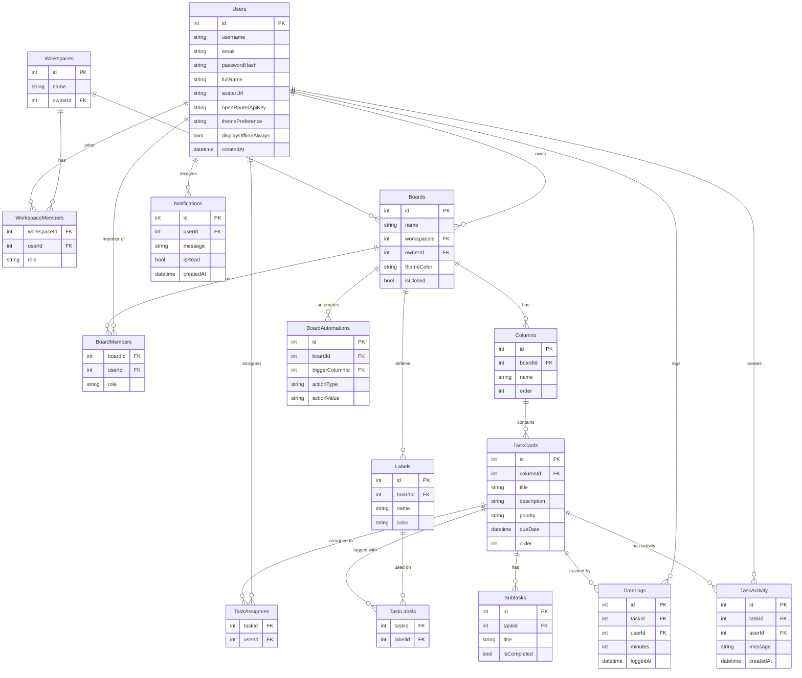

<h1 align="center">
  <br>
  🚀 NexusFlow
  <br>
</h1>

<h4 align="center">A real-time, full-stack Agile collaboration platform built with <a href="https://dotnet.microsoft.com/" target="_blank">.NET 9</a> and <a href="https://react.dev/" target="_blank">React 19</a> - with deep AI integration powered by OpenRouter.</h4>

<p align="center">
  
  
  
  
  
</p>

<p align="center">
  <a href="#-features">Features</a> •
  <a href="#-architecture">Architecture</a> •
  <a href="#-tech-stack">Tech Stack</a> •
  <a href="#-getting-started">Getting Started</a> •
  <a href="#-project-structure">Project Structure</a> •
  <a href="#-issues--feedback">Issues & Feedback</a>
</p>

---

## 📖 About

NexusFlow is a production-grade project management tool inspired by Trello and Jira, built from the ground up as a full-stack portfolio project. It features real-time collaboration via SignalR WebSockets, a rich Kanban board with drag-and-drop, multiple view modes, and a deep AI layer powered by the OpenRouter API.

---

### 🎬 Demo

### Real-Time Collaboration (SignalR)
<video src="https://github.com/user-attachments/assets/1ed8b99b-13d9-4231-b8c6-ae2073e50988" controls width="100%"></video>

### AI Features (Generation, Breakdown, Enhancements)

### AI Architect
<video src="https://github.com/user-attachments/assets/02251b06-92b8-4b4c-9444-c141f329667f" controls width="100%"></video>

#### Board & Task Generation
<video src="https://github.com/user-attachments/assets/0a81f09f-61c6-495e-b391-52a46a19e607" controls width="100%"></video>

#### Task Breakdown & Subtasks
<video src="https://github.com/user-attachments/assets/6a977cfa-6429-4a88-98bc-d1a1c54dbf1a" controls width="100%"></video>

#### Diagram Generation
<video src="https://github.com/user-attachments/assets/c3b9c2ac-31c2-4c55-8f8e-e8cc5c98de0b" controls width="100%"></video>

#### Text Enhancements & Writing Assistant
<video src="https://github.com/user-attachments/assets/c6ca44fe-ba7f-42f2-a5de-06bd37ca84ca" controls width="100%"></video>

### Board Views (Table, Calendar, Timeline, Dashboard)
<video src="https://github.com/user-attachments/assets/ed3accd7-0889-41cd-b3da-932623f3356e" controls width="100%"></video>

---

## ✨ Features

### 🗂️ Board & Task Management
- **Drag-and-Drop Kanban boards** — Move tasks and columns with optimistic UI updates (no lag, instant feedback, server-sync with automatic rollback on failure)
- **Multiple View Modes** — Switch between Board, Table, Calendar, Timeline, and Dashboard analytics views on any board
- **Rich Task Cards** — Tasks support assignees, labels, due dates, priorities, attachments, checklists (subtasks), time logging, and a **rich-text description editor**
- **Board Templates** — Create new boards from pre-configured templates (Kanban, Scrum, etc.)
- **Board Lifecycle** — Boards can be closed (read-only) and reopened; permanently deleted by admins
- **Trash Zone** — Drag a card to the trash drop zone to delete it instantly

### 👥 Workspaces & Teams
- **Workspace Management** — Organize multiple boards under a workspace with member management
- **Role-Based Access Control** — Owner, Admin, Member, and Viewer roles scoped to both workspaces and individual boards
- **Invite System** — Invite members by username search or generate shareable invite links with configurable roles
- **My Tasks Page** — A personal cross-board view of all tasks assigned to you

### ⚡ Real-Time Collaboration (SignalR)
- **Live board updates** — Every task creation, move, update, and delete is broadcast via SignalR to all connected members — no page refresh needed
- **Live column management** — Column creation, rename, reorder, and deletion synced in real time
- **Presence Tracking** — See green online indicators for each board member who is currently viewing the board
- **Live Notifications** — In-app notification drawer with real-time delivery for board events
- **Conflict-safe drag-and-drop** — Server updates from other users are silently queued while you're dragging to prevent UI conflicts

### 🤖 AI Features (OpenRouter Integration)

NexusFlow includes a deep AI layer powered by the **OpenRouter API** — a unified gateway to models like `stepfun/step-3.5-flash` with automatic fallback to `google/gemini-2.0-flash`. Users configure their own API key in their profile, validated live before it is ever saved.

- **AI Board & Task Generation** — Describe your project idea and choose a template type (Kanban, Scrum, Sales/CRM, Bug Tracking). The AI generates a complete ready-to-use board: all columns and 6–10 pre-seeded tasks, each with a unique title, detailed description, and priority level.
- **AI Task Injection per Column** — Inside any board, click the ✨ AI button on a column and type a plain-language instruction (e.g. *"set up CI/CD pipeline"*). The AI intelligently breaks it down into 3–5 distinct, actionable tasks.
- **Rich Text AI Writing Assistant** — The task description editor (TipTap) has a built-in AI toolbar with **6 modes**:
  - 🔁 **Enhance** — Improve clarity and structure of existing text
  - ✏️ **Fix Grammar** — Correct grammar and spelling
  - ✂️ **Shorten** — Condense content while preserving key info
  - 💼 **Make Professional** — Rewrite in a formal, professional tone
  - 💬 **Custom Instruction** — Type any natural-language instruction for the AI to follow
  - ✍️ **Write from Title** — Auto-generate a full task description just from the task title
- **AI Subtask Generation** — Inside the task detail modal, the AI reads the task title and description to generate 3–7 concrete, actionable subtask checklist items automatically.
- **AI Diagram Generation** — The AI can generate a PlantUML Entity-Relationship or architectural diagram based on context you describe, rendered inline in the task modal.
- **Smart model fallback** — Requests go to the primary model first; if it fails, the system automatically retries with the fallback model transparently.
- **Per-user key management** — Each user stores their own OpenRouter key (encrypted at rest), validated by a real API call before ever being persisted.

### 👤 User Profiles & Appearance
- **Rich profile page** — Edit full name, job title, department, organization, location, bio, and avatar (URL or file upload)
- **Username customization** — Change your display username with real-time validation
- **Theme preference** — Light/Dark mode toggle, persisted server-side per user
- **Privacy mode** — "Appear offline always" toggle to hide your online presence from teammates

### 🔔 Notifications & Activity
- **In-app notification drawer** — Real-time notification feed powered by SignalR
- **Activity log** — Per-card activity feed tracking all changes (moves, edits, comments, status changes)
- **Emoji reactions** — React to activity log entries

### 📊 Analytics & Automations
- **Board Analytics Modal** — Visual charts for task completion rates, priority distribution, and member workload
- **Board Automations** — Rule-based automations (e.g., auto-assign a label or change priority when a card moves to a specific column)
- **Time Logging** — Track time spent on individual tasks; per-task time logs

---

## 🏗️ Architecture

NexusFlow is structured as three loosely coupled layers communicating over HTTP REST and WebSockets.

### Overview

The **React 19 frontend** (Vite + TypeScript) communicates with the **ASP.NET Core Web API** (.NET 9) over two channels:
- **HTTP/REST** with JWT Bearer tokens for standard CRUD operations
- **SignalR WebSockets** for real-time push events (task moves, presence updates, notifications)

The API is organized into a **thin controller → scoped service → EF Core** pipeline. Business logic lives entirely in injectable service classes (`IBoardService`, `ITaskService`, etc.), keeping controllers as simple request routers. A singleton `PresenceTracker` service maintains an in-memory map of which users are online on which boards, without any database polling.

The **PostgreSQL database** (provisioned via Supabase — local Docker for development, cloud for production) is fully managed by **EF Core code-first migrations**, making the schema reproducible on any machine.

AI requests are made **directly from the frontend** using the user's own OpenRouter API key, so AI credentials never transit the backend server.

### System Architecture Diagram



### Key Design Decisions

| Decision | Rationale |
|---|---|
| **Optimistic UI** | All mutations update the UI instantly and roll back automatically if the server returns an error, providing seamless UX with no perceived latency. |
| **SignalR presence tracking** | A singleton `PresenceTracker` maps `ConnectionId`s to `UserId`s and `BoardId`s, enabling live online indicators without polling. |
| **Service layer pattern** | Business logic lives in scoped services injected via ASP.NET Core DI, keeping controllers thin and testable. |
| **Code-First migrations** | The entire database schema is defined in C# and managed via EF Core migrations, making it fully reproducible from any machine. |
| **Drag-and-drop conflict guard** | When a user is mid-drag, incoming SignalR `TaskMoved` events are silently queued via an `isDraggingRef` guard and applied after the drag ends, preventing ghost-card artifacts. |
| **Per-user AI key validation** | The OpenRouter API key is validated by making a real test call before being persisted, ensuring no broken keys are ever stored. |

---

## 🛠️ Tech Stack

| Layer | Technology |
|---|---|
| **Backend** | C# / .NET 9, ASP.NET Core Web API |
| **ORM** | Entity Framework Core 9 (Code-First) |
| **Database** | PostgreSQL (via Supabase — local Docker or cloud) |
| **Auth** | JWT Bearer tokens + BCrypt password hashing |
| **Real-Time** | ASP.NET Core SignalR (WebSockets) |
| **Frontend** | React 19, TypeScript 5, Vite |
| **UI Library** | Mantine 7 (dark/light theme) |
| **Drag & Drop** | @hello-pangea/dnd |
| **Rich Text** | TipTap editor |
| **Icons** | Tabler Icons |
| **HTTP Client** | Axios |
| **AI** | OpenRouter API (user-supplied key) |

---

## 🚀 Getting Started

> **Full setup guide:** See [SETUP.md](./SETUP.md) for detailed instructions.

### Prerequisites

| Tool | Version |
|---|---|
| [.NET SDK](https://dotnet.microsoft.com/download) | 9.0+ |
| [Node.js](https://nodejs.org/) | 18+ |
| [Docker Desktop](https://www.docker.com/products/docker-desktop/) | Latest |

### Option A — Local Docker (Recommended)

This spins up a full local Supabase (PostgreSQL) environment automatically.

**First-time setup** (run once after cloning):
```powershell
.\init-dev.ps1
```

**Daily development** (after first-time setup):
```powershell
.\start-dev.ps1
```

The script automatically starts Supabase, applies migrations, and launches both the backend (`localhost:5145`) and frontend (`localhost:5173`).

### Option B — Cloud Supabase

If you prefer not to use Docker, point the app to a cloud Supabase project.

**1. Create a Supabase project** at [supabase.com](https://supabase.com) and copy your connection string.

**2. Configure the backend** (`backend/appsettings.json`):
```json
{
  "ConnectionStrings": {
    "DefaultConnection": "YOUR_SUPABASE_CONNECTION_STRING"
  },
  "JwtSettings": {
    "SecretKey": "your-strong-random-secret-key-min-32-chars",
    "Issuer": "NexusFlow",
    "Audience": "NexusFlowUsers"
  }
}
```

**3. Apply migrations:**
```bash
cd backend
dotnet ef database update
```

**4. Run the backend:**
```bash
cd backend
dotnet run
# → API running at http://localhost:5145
```

**5. Run the frontend:**
```bash
cd frontend
npm install
npm run dev
# → App running at http://localhost:5173
```

---

## 📐 Diagrams

> These diagrams use **Mermaid.js** which is natively rendered by GitHub — no plugins needed.

### Database Entity-Relationship Diagram



### SignalR Real-Time Event Flow

```mermaid
sequenceDiagram
    participant UA as User A (Browser)
    participant UB as User B (Browser)
    participant API as ASP.NET Core API
    participant HUB as BoardHub (SignalR)
    participant PT as PresenceTracker
    participant DB as PostgreSQL

    rect rgb(40, 44, 60)
        Note over UA,PT: Connection & Board Join
        UA->>HUB: connect(JWT via query string)
        HUB->>PT: RegisterUser(userId, connectionId)
        UA->>HUB: JoinBoard(boardId)
        HUB->>PT: AddToBoard(userId, boardId)
        HUB-->>UA: PresenceUpdated(onlineUserIds)
        HUB-->>UB: PresenceUpdated(onlineUserIds)
    end

    rect rgb(40, 44, 60)
        Note over UA,DB: Task Move (Drag & Drop)
        UA->>API: PUT /api/tasks/{id}/move
        API->>DB: UPDATE TaskCard
        DB-->>API: updated task
        API->>HUB: Clients.Group(boardId).SendAsync("TaskMoved")
        HUB-->>UA: TaskMoved(task)
        HUB-->>UB: TaskMoved(task)
        Note right of UB: isDraggingRef guard defers<br/>update if UB is mid-drag
    end

    rect rgb(40, 44, 60)
        Note over API,DB: Automation Trigger
        API->>DB: SELECT automations WHERE boardId
        DB-->>API: matching rules
        API->>DB: UPDATE task (e.g. priority = High)
        API->>HUB: SendAsync("TaskUpdated", task)
        HUB-->>UA: TaskUpdated(task)
        HUB-->>UB: TaskUpdated(task)
    end

    rect rgb(40, 44, 60)
        Note over UA,UB: Disconnection
        UA->>HUB: disconnect
        HUB->>PT: RemoveUser(connectionId)
        HUB-->>UB: PresenceUpdated(onlineUserIds)
    end
```



---

## 📁 Project Structure

```
NexusFlow/
│
├── backend/                         # ASP.NET Core Web API (.NET 9)
│   ├── Controllers/                 # API route controllers
│   │   ├── AuthController.cs        # Register / Login / JWT
│   │   ├── BoardsController.cs      # Board CRUD & member management
│   │   ├── TasksController.cs       # Task CRUD & drag-drop moves
│   │   ├── WorkspacesController.cs  # Workspace & workspace invites
│   │   ├── AnalyticsController.cs   # Board statistics & charts
│   │   ├── AutomationsController.cs # Board automation rules
│   │   ├── NotificationsController.cs
│   │   ├── TimeLogsController.cs    # Per-task time tracking
│   │   ├── AttachmentsController.cs
│   │   ├── LabelsController.cs
│   │   └── UsersController.cs       # User profile & search
│   ├── Hubs/
│   │   └── BoardHub.cs              # SignalR hub (real-time events + presence)
│   ├── Models/                      # EF Core entity models
│   ├── DTOs/                        # Request/Response data shapes
│   ├── Services/                    # Business logic (DI scoped services)
│   ├── Data/
│   │   └── AppDbContext.cs          # EF Core DbContext
│   ├── Migrations/                  # EF Core code-first migrations
│   └── Program.cs                   # App bootstrap, DI, middleware pipeline
│
├── frontend/                        # React 19 + TypeScript + Vite
│   └── src/
│       ├── api/                     # Axios API client functions
│       ├── components/              # Reusable UI components
│       │   ├── TaskDetailModal.tsx  # Full task editor modal
│       │   ├── BoardColumn.tsx      # Kanban column with DnD
│       │   ├── TaskCard.tsx         # Task card component
│       │   ├── AppNavbar.tsx        # App-wide navigation bar
│       │   ├── BoardCalendarView.tsx
│       │   ├── BoardTimelineView.tsx
│       │   ├── BoardTableView.tsx
│       │   ├── BoardDashboardView.tsx
│       │   ├── BoardAnalyticsModal.tsx
│       │   ├── BoardAutomationsModal.tsx
│       │   ├── NotificationDrawer.tsx
│       │   └── ActivityLog.tsx
│       ├── pages/                   # Top-level route pages
│       │   ├── BoardPage.tsx        # Main Kanban board
│       │   ├── BoardsPage.tsx       # Board listing & workspace sidebar
│       │   ├── WorkspaceDashboard.tsx
│       │   ├── WorkspaceDetailsPage.tsx
│       │   ├── MyTasksPage.tsx      # Personal cross-board task view
│       │   ├── ProfilePage.tsx      # User settings & AI config
│       │   ├── LoginPage.tsx
│       │   ├── RegisterPage.tsx
│       │   ├── JoinBoardPage.tsx    # Invite link landing page
│       │   └── JoinWorkspacePage.tsx
│       ├── hooks/
│       │   ├── useSignalR.ts        # SignalR connection & event hook
│       │   └── useKeyboardShortcuts.ts
│       ├── contexts/
│       │   └── PresenceContext.tsx  # Online user IDs context
│       ├── constants/
│       │   └── themes.ts            # Board color themes
│       └── App.tsx                  # React Router route definitions
│
├── supabase/                        # Supabase local config
├── init-dev.ps1                     # First-time dev environment setup script
├── start-dev.ps1                    # Daily dev startup script (all services)
├── SETUP.md                         # Detailed setup documentation
└── README.md
```

---

## 🤝 Issues & Feedback

This is a solo portfolio project — pull requests are not accepted, but **bug reports and feature suggestions are very welcome!**

If you find a bug or have an idea, please [open an issue](../../issues) with as much detail as possible (steps to reproduce, expected vs actual behavior, screenshots if relevant).

---

---

## ❓ FAQ

**Q: Do I need to pay for OpenRouter to use the AI features?**  
A: OpenRouter has a free tier with rate limits that is sufficient for personal use. Some models may require credits. Each user supplies their own key, so costs are individual.

**Q: Can I use this without Docker?**  
A: Yes — see [Option B in Getting Started](#option-b--cloud-supabase) to connect to a free cloud Supabase project instead.

**Q: Is the OpenRouter key stored securely?**  
A: Yes. Keys are encrypted at rest in the database and validated before being saved, so invalid keys are never persisted.

---

## 📄 License

This project is licensed under a **Custom Proprietary License** (Non-Commercial, No-Derivatives).

- ✅ **Allowed**: Personal use, educational testing, and private forks.
- ❌ **Forbidden**: Commercial use, selling as a product, or redistributing modified versions as your own.

See the [LICENSE](LICENSE) file for the full legal text.

---

<p align="center">
  Built with ❤️ as a full-stack portfolio project — <strong>NexusFlow</strong>
</p>
